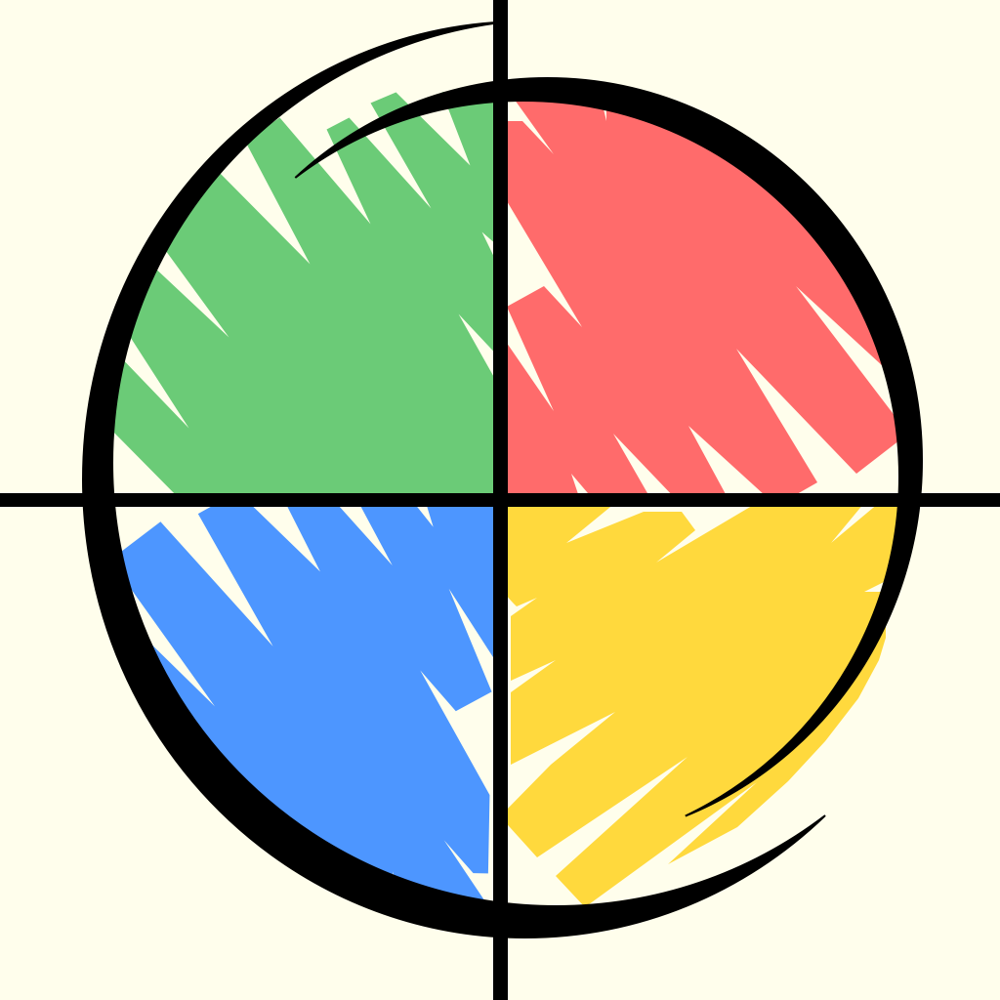

# The Evolution of Mimic+: Visuals, Features and Metrics

Since its first release in 2015, Mimic+ has gone through several visual, technical, and architectural overhauls—always driven by the desire to improve gameplay, support more devices, and reach a wider audience.

Below you’ll find a visual timeline of icons across versions, UI evolution snapshots, and a high-level table showing how the game grew.

## Icons and other evolutions

<table>
<tr>
    <th>Years</th>
    <th>2015</th>
    <th>2018</th>
    <th>2020</th>
    <th>2021</th>
    <th>2025</th>
</tr>
<tr>
    <th>Release</th>
    <td>1.0</td>
    <td>1.1</td>
    <td>2.0 ~ 2.4</td>
    <td>2.4.1</td>
    <td>3.0</td>
</tr>
<tr>
    <th>iOS</th>
    <td>6.0</td>
    <td>11.0</td>
    <td>12.0</td>
    <td>13.0</td>
    <td>15.0</td>
</tr>
<tr>
    <th>Language</th>
    <td>Objective-C</td>
    <td>Swift 4.2</td>
    <td>Swift 5.3</td>
    <td>Swift 5.4</td>
    <td>Swift 5.7</td>
</tr>
<tr>
    <th>Lines of Code</th>
    <td></td>
    <td></td>
    <td></td>
    <td>1.839</td>
    <td>1.447</td>
</tr>
<tr>
    <th>Mimic+  Icon (paid version)</th>
    <td></td>
    <td></td>
    <td></td>
    <td></td>
    <td></td>
</tr>
<tr>
    <th>Size</th>
    <td>21.7MB</td>
    <td>21.7MB</td>
    <td>28.8MB</td>
    <td>28.8MB</td>
    <td>5.3MB</td>
</tr>
<tr>
    <th>Mimic+ lite Icon (free version)</th>
    <td></td>
    <td></td>
    <td></td>
    <td></td>
    <td></td>
</tr>
<tr>
    <th>Size</th>
    <td>21.8MB</td>
    <td>21.7MB</td>
    <td>31.6MB</td>
    <td>31.5MB</td>
    <td>8.5MB</td>
</tr>
</table>

## Themes Snapshots

<table>
<tr>
    <th>Themes</th>
<!--    <td>1.0</td>-->
<!--    <td>1.1</td>-->
<!--    <td>2.0 ~ 2.4</td>-->
    <td>2.4.1</td>
    <td>3.0</td>
</tr>
<tr>
    <th>Classic</th>
    <td></td>
    <td></td>
</tr>
<tr>
    <th>Piano</th>
    <td></td>
    <td></td>
</tr>
<tr>
    <th>Kids</th>
    <td></td>
    <td></td>
</tr>
<tr>
    <th>Aquarela replaced by Wormarium</th>
    <td></td>
    <td></td>
</tr>
</table>

## 📈 Download Growth by Year

| Year  | Downloads (Paid + Free) |
|-------|-------------------------|
| 2015  | 1.786                   |
| 2016  | 338                     |
| 2017  | 2.874                   |
| 2018  | 714                     |
| 2019  | 945                     |
| 2020  | 14.746                  |
| 2021  | 10.265                  |
| 2022  | 1.175                   |
| 2023  | 945                     |
| 2024  | 586                     |
| 2025  | 106 (partial)           |
| **Total** | **35,147**          |

